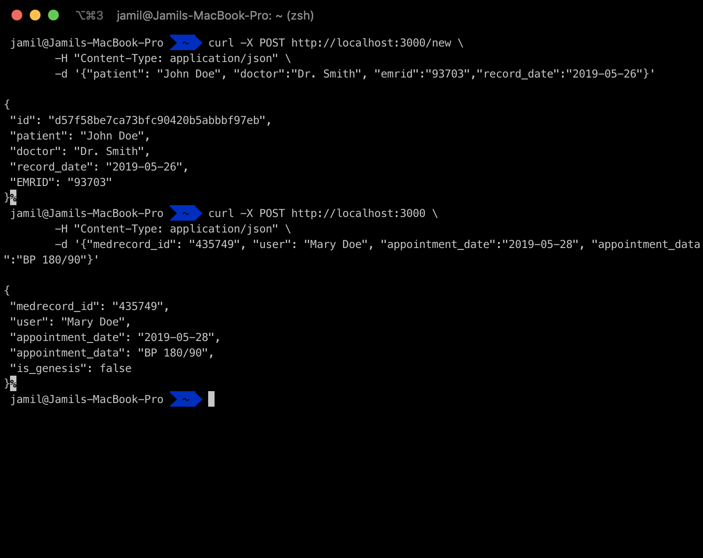
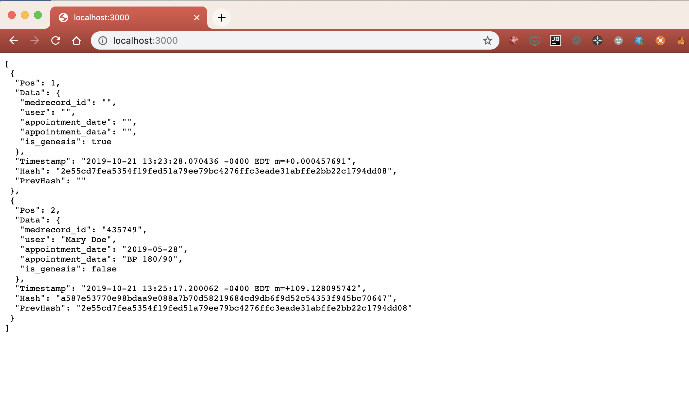

## Simple Blockchain with Go

In this project I will create a simple blockchain that stores medical data in Go.


### Installation/Usage
Clone Repository
```shell
$ git clone https://github.com/blackguywhocodes/qonsonance.git
```

**Run app**
```shell
$ go run app.go

```

**Create Blocks**
```shell
$ curl -X POST http://localhost:3000/new \
	-H "Content-Type: application/json" \
	-d '{"patient": "John Doe", "doctor":"Dr. Smith", "emrid":"93703","record_date":"2019-05-26"}'


$ curl -X POST http://localhost:3000 \
	-H "Content-Type: application/json" \
	-d '{"medrecord_id": "435749", "user": "Mary Doe", "appointment_date":"2019-05-28", "appointment_data":"BP 180/90"}'

```

**View in Browser**
Navigate to `http://localhost:3000` to view the full blocks

### Screenshot




**Todo Items**
1) Enable blockchain persistance
2) Multi-node broadcast
3) CLI commands
4) Client application to interface with Blockchain